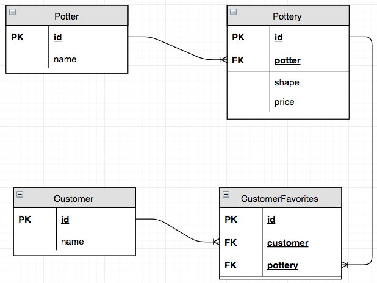

# Relational Data

During this milestone, you will need to start thinking about how data relationships work. This comprehension is important for the next milestone when you start working with databases.

Let's build a basic program that deals with potters, the pottery they create, and customers interested in pottery. First, define the three classes that represent the types of objects in the application.

## One to Many

The following relationship is called a **One to Many** relationship.

> Can a potter have many pieces of pottery? Yes.

> Can a piece of pottery have many potters? No.

```py
# This built-in package allow you to generate guaranteed unique string
import uuid

class Potter:

  def __init__(self, first_name, last_name):
    self.id = str(uuid.uuid1())
    self.name = "{} {}".format(first_name, last_name)


class Pottery:

  def __init__(self, shape, price, potter):
    self.id = str(uuid.uuid1())
    self.shape = shape
    self.price = price
    self.potter_id = potter.id


class Customer:

  def __init__(self, name):
    self.id = str(uuid.uuid1())
    self.name = name
```

Note that each object will have an `id` property. When dealing with relational data, we can call that property the **Primary Key** of the object -- its unique identifer.

Next, consider the relationship between `Potter` and `Pottery`. Notice how the 3rd argument to the `Pottery.__init__()` method is `potter`. That's the actual instance of a Potter, and that Potter's `id` value is now being stored as a property of an instance of `Pottery`.

```py
>>> all_potters = list() # A list to store all Potter instances
>>> juan = Potter('Juan', 'Rodriguez')
>>> all_potters.append(juan)
>>> print(juan.id)

123455678

>>> all_pottery = list() # A list to store all Pottery instances
>>> coffee_mug = Pottery('cup', '19.00', juan)
>>> all_pottery.append(coffee_mug)
>>> print(coffee_mug.potter_id)

123455678
```

By storing the unique identifier - or primary key - of the Juan as a property of the coffee mug, we now have created a relationship between the two objects. The `potter_id` property of the coffee mug is called a **Foreign Key**.

```py
class Potter:

  def __init__(self, first_name, last_name):
    self.id = str(uuid.uuid1())           <~~~~~  Primary Key ~~~~~
    self.name = "{} {}".format(first_name, last_name)              |
                                                                   |
                                                                   |
class Pottery:                                                     |
                                                                   |
  def __init__(self, shape, price, potter):                        |
    self.id = str(uuid.uuid1())                                    |
    self.shape = shape                                             |
    self.price = price                                             |
    self.potter_id = potter.id            <~~~~~ Foreign Key ~~~~~~
```

That **Primary Key -> Foreign Key** relationship is how we connect the two objects, instead of storing the Potter's information on the piece of Pottery. If we have a piece of pottery, and we want to determine who made it, we use that relationship to find the information.

```py
>>> coffee_mug_maker = [potter in all_potters if coffee_mug.potter_id = potter.id][0]
>>> print(coffee_mug_maker.id)

123455678
```

## Many to Many

The following relationship is called a **Many to Many** relationship.

> Can a pieces of pottery be liked by many customers? Yes.

> Can a customer like many pieces of pottery? Yes.

In a many to many relationship, you can't store the customer's id on the piece of pottery because then only one customer can like it. You also can't store the liked piece of pottery's id on the customer because the customer can only like one piece.

What you need to do is store the relationship itself in a separate construct, such as a list, dictionary, or tuple.

Here's a visualization of the relationships between all the objects in our system.



Here's an example of how to represent those relationships in Python using collections. Let's use dictionaries to make it easier to look up items without having to iterate over lists or tuples.

```py
# Create collections to hold all the objects in our application
all_potters = dict()
all_pottery = dict()
all_customers = dict()
```

Next, we'll create Juan, a potter, and then instances of `Pottery` for each type of piece that he makes.

```py
# Define Juan and the two piece he makes
juan = Potter('Juan', 'Rodriguez')
all_potters[juan.id] = juan

coffee_mug = Pottery('cup', '19.00', juan)
plate = Pottery('plate', '42.00', juan)

all_pottery[coffee_mug.id] = coffee_mug
all_pottery[plate.id] = plate
```

Then do the same for another potter, Amy, and all the pieces she likes to make.

```py
# Define Amy and the two piece he makes
amy = Potter('Amy', 'Lee')
all_potters[amy.id] = amy

soap_dish = Pottery('dish', '7.50', amy)
all_pottery[soap_dish.id] = soap_dish

platter = Pottery('platter', '61.00', amy)
all_pottery[platter.id] = platter
```

Now that you're established all the potters and pottery, use the `pprint` package to output the dictionaries in a more legible format.

```py
print("::Potters")
pprint.pprint(all_potters)
print("\n::Pottery")
pprint.pprint(all_pottery)
```

Run your program now, and you should see output similar to this.

```
::Potters
{'1044e85c-68ca-11e6-9fd7-3c075475cf9b': <__main__.Potter object at 0x1031adad0>,
 '1047dd00-68ca-11e6-bf7f-3c075475cf9b': <__main__.Potter object at 0x103259fd0>}

::Pottery
{'1047d72e-68ca-11e6-a94d-3c075475cf9b': <__main__.Pottery object at 0x1032f1310>,
 '1047db28-68ca-11e6-8ca6-3c075475cf9b': <__main__.Pottery object at 0x103259990>,
 '1047dea4-68ca-11e6-8942-3c075475cf9b': <__main__.Pottery object at 0x103259310>,
 '1047e090-68ca-11e6-82b2-3c075475cf9b': <__main__.Pottery object at 0x103259b10>}
```

The next step is to create some customer instances so that you can determine which pieces of pottery that they will like.

```py
# Now create some customers
caleb = Customer('Caleb Sholze')
kaylee = Customer('Kaylee Cummings')
sally = Customer('Sally Fisher')

# Add customers to the main customer dictionary
all_customers[caleb.id] = caleb
all_customers[sally.id] = sally
all_customers[kaylee.id] = kaylee

print("\n::Customers")
pprint.pprint(all_customers)
```

Again, run the program and see the following output

```
::Customers
{'1047e21e-68ca-11e6-a904-3c075475cf9b': <__main__.Customer object at 0x10325f3d0>,
 '1047e3de-68ca-11e6-b478-3c075475cf9b': <__main__.Customer object at 0x10325f490>,
 '1047e570-68ca-11e6-bab8-3c075475cf9b': <__main__.Customer object at 0x10325f390>}
```

Now that there are some customer, and some pottery, you can start tracking the many to many relationship by storing the `id` of each type in a collection. Again, start off with a dictionary to hold each relationship.

```py
# Create a dictionary that will hold a collection of relationships
customer_favorites = dict()
```

Next, add a blank relationship dictionary to the main container. The relationship will also have a unique identifier.

```py
# Add a dictionary to the favorites collection.
# This dictionary holds the relationship  between customers and pottery.
relationship = customer_favorites[str(uuid.uuid1())] = {}
```

Now you can store the relationship between a customer and a piece of pottery. By storing just the id of each object instance, it prevents duplicate data being stored in multiple locations. Look back at how you stored each potter, piece of pottery and customer in the main dictionaries. You took the `id` property of each one and made it the key for that entry.

Let's see how it works. Make a relationship.

```py
# Caleb likes the plate
relationship["customer"] = caleb.id
relationship["pottery"] = plate.id
```

Now, print out the `customer_favorites` dictionary.

```
{'029dee6c-693b-11e6-a46c-3c075475cf9b': {'customer': '029dcca2-693b-11e6-945b-3c075475cf9b',
                                          'pottery': '029dc952-693b-11e6-b6cb-3c075475cf9b'}}
```

It has one entry storing a relationship. The relationship itself is uniquely identified, and has two key/value pairs identifying the customer and the pottery.

Add some more relationships.

```py
# Sally likes the plate
relationship = customer_favorites[str(uuid.uuid1())] = {}
relationship["customer"] = sally.id
relationship["pottery"] = plate.id

# Sally likes the soap dish
relationship = customer_favorites[str(uuid.uuid1())] = {}
relationship["customer"] = sally.id
relationship["pottery"] = soap_dish.id

# Kaylee likes the soap platter
relationship = customer_favorites[str(uuid.uuid1())] = {}
relationship["customer"] = kaylee.id
relationship["pottery"] = platter.id

# Pretty print the results to make them easier to read
pprint.pprint(customer_favorites)
```

Now there are four relationships stored in `customer_favorites`.

```
{'54ee3a1c-693b-11e6-852b-3c075475cf9b': {'customer': '54ee04cc-693b-11e6-a4c9-3c075475cf9b',
                                          'pottery': '54edff90-693b-11e6-b068-3c075475cf9b'},
 '54ee3bae-693b-11e6-b65e-3c075475cf9b': {'customer': '54ee0622-693b-11e6-a6c3-3c075475cf9b',
                                          'pottery': '54edff90-693b-11e6-b068-3c075475cf9b'},
 '54ee3cee-693b-11e6-a9cd-3c075475cf9b': {'customer': '54ee0622-693b-11e6-a6c3-3c075475cf9b',
                                          'pottery': '54ee025e-693b-11e6-ba49-3c075475cf9b'},
 '54ee3e06-693b-11e6-a95a-3c075475cf9b': {'customer': '54ee075e-693b-11e6-ac5f-3c075475cf9b',
                                          'pottery': '54ee0394-693b-11e6-aa42-3c075475cf9b'}}
```

Now you can iterate over the collection of relationships to display information about which pottery is liked by which customers. Because you used the `id` values to identify each object in the main dictionaries, finding the objects, and their values becomes much easier.

```py
[print("{} likes the {}".format(
    all_customers[relationship["customer"]].name,
    all_pottery[relationship["pottery"]].shape))
 for rel_id, relationship in customer_favorites.items()]
```

> Output

```
Caleb Sholze likes the plate
Sally Fisher likes the dish
Sally Fisher likes the plate
Kaylee Cummings likes the platter
```

## Joining in the Potter

Since we stored a relationship between a Customer instance and a Pottery instance, reaching into the `all_customers` and `all_pottery` dictionaries is straightforward. However, how would you also display the Potter who made the Pottery? How would you produce the following output?

```
Caleb Sholze likes the plate made by Juan Rodriguez
Sally Fisher likes the dish made by Amy Lee
Sally Fisher likes the plate made by Juan Rodriguez
Kaylee Cummings likes the platter made by Amy Lee
```

There is also a relationship between Pottery and Potter: the one to many relationship. You established that relationship, not in a seperate dictionary, but by storing the `id` of the Potter in the Pottery itself.

So all you need to do is look in the `all_potters` dictionary for the value of the `potter_id` property of the Pottery.

```py
[print("{} likes the {} made by {}".format(
    all_customers[relationship["customer"]].name,
    all_pottery[relationship["pottery"]].shape,
    all_potters[all_pottery[relationship["pottery"]].potter_id].name),
  )
 for rel_id, relationship in customer_favorites.items()]
```


